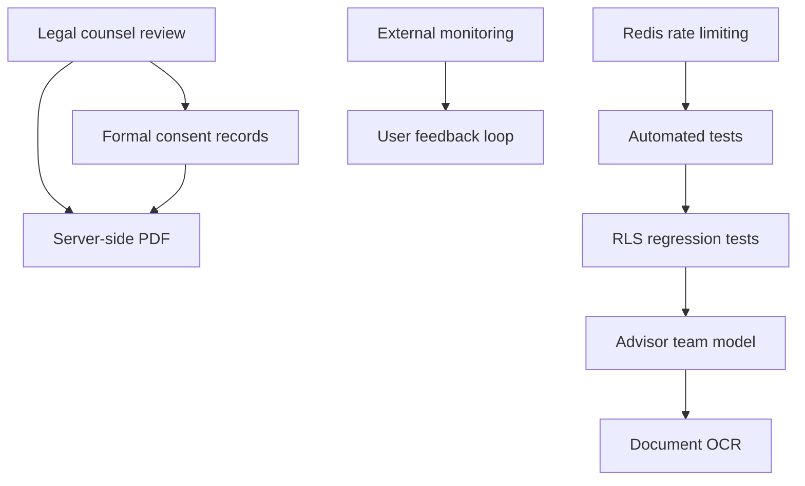

# Beta Roadmap After Launch — Phase 4Z

**Date:** 2026-06-10  
**Purpose:** Prioritized work after demo / private beta launch toward real production.

**Related:** [Beta Limitations & Risks](./BETA_LIMITATIONS_AND_RISKS.md) · [Go / No-Go Criteria](./GO_NO_GO_CRITERIA.md)

---

## Priority tiers

| Tier | Target | Theme |
|------|--------|-------|
| **P0** | Before real-client production | Legal, consent, monitoring, rate limits |
| **P1** | First 30 days post-beta | PDF pipeline, tests, team model planning |
| **P2** | 30–90 days | Document intelligence, feedback loop |

---

## P0 — Production blockers

### 1. Legal counsel review

- Engage qualified counsel for Singapore / applicable jurisdiction
- Review `/legal/terms`, `/legal/privacy`, `/legal/disclaimer`, `/legal/consent`
- Review report disclaimers and document-upload consent copy
- Remove or update draft-template warnings after approval
- **Exit criteria:** Written sign-off; copy deployed to production

### 2. Redis / Upstash rate limiting

- Replace in-memory buckets with shared store
- Apply to write-heavy routes, health endpoints, signed-url routes
- Load-test under multi-instance Vercel deploy
- **Exit criteria:** Global rate limits verified across 2+ instances

### 3. External monitoring and alerting

- Integrate Sentry, Axiom, Logtail, or equivalent
- Wire `captureServerError` on API catch blocks
- Alert on 5xx rate, auth anomaly spikes, audit insert failures
- **Exit criteria:** On-call receives test alert; dashboard reviewed weekly

### 4. Formal consent records

- Database table: user/client, consent type, version, timestamp, IP (optional)
- Record banner dismiss, document upload consent, advisor access acknowledgment
- Admin export for compliance requests
- **Exit criteria:** Consent queryable per client; linked to legal version

---

## P1 — Hardening (first 30 days)

### 5. Server-side PDF generation or storage

- Evaluate `@react-pdf/renderer`, Puppeteer, or Supabase Storage PDF archive
- Immutable artifact per Wealth Blueprint / Annual Review snapshot
- Retention and access policy aligned with legal review
- **Exit criteria:** PDF downloadable and stored with snapshot reference

### 6. Stronger automated tests

- Integration tests for auth flows and role matrix
- CI gate on `npm run build`, `tsc`, `qa:smoke`, `security:audit`
- Expand smoke tests for authenticated paths (fixture tokens)
- **Exit criteria:** CI blocks merge on test failure

### 7. RLS regression tests

- SQL or integration tests for C-1 fix (role self-update denied)
- Cross-tenant read/write denial for client, advisor, admin
- Storage policy tests for `client-documents` bucket
- **Exit criteria:** Regression suite runs on every migration change

### 8. Advisor team model

- Design firm / team / delegate permissions
- Update `clients.advisor_user_id` model or add `client_advisors` junction
- RLS and API guard updates
- **Exit criteria:** Two advisors on one client with scoped permissions

---

## P2 — Product depth (30–90 days)

### 9. Document OCR / classification

- Auto-categorize uploads (insurance, CPF, estate, etc.)
- Feed file-quality scoring with extracted signals
- Privacy review for third-party OCR providers
- **Exit criteria:** Pilot classification on staging with advisor override

### 10. User feedback loop

- In-app feedback widget for beta pilots
- Structured issue template (role, page, severity)
- Weekly triage with engineering + product
- **Exit criteria:** Feedback channel live; first sprint of fixes shipped

---

## Suggested sequence

```
Week 1–2:  Legal engagement + monitoring integration
Week 2–3:  Redis rate limits + consent schema design
Week 3–4:  Consent implementation + RLS regression tests
Week 4–6:  PDF pipeline + CI test expansion
Week 6–8:  Advisor team model design + pilot
Week 8+:   OCR/classification spike + feedback iteration
```

---

## Dependencies map



---

## Success metrics (post-beta)

| Metric | Target |
|--------|--------|
| P0 production blockers closed | 4/4 |
| CI green on main | 7 consecutive days |
| Mean time to detect 5xx spike | < 15 minutes |
| Pilot NPS or qualitative feedback | Documented monthly |
| Open P0/P1 security findings | 0 |

---

## Tracking

Log progress in project tracker; link PRs to limitation IDs in [Beta Limitations & Risks](./BETA_LIMITATIONS_AND_RISKS.md).
