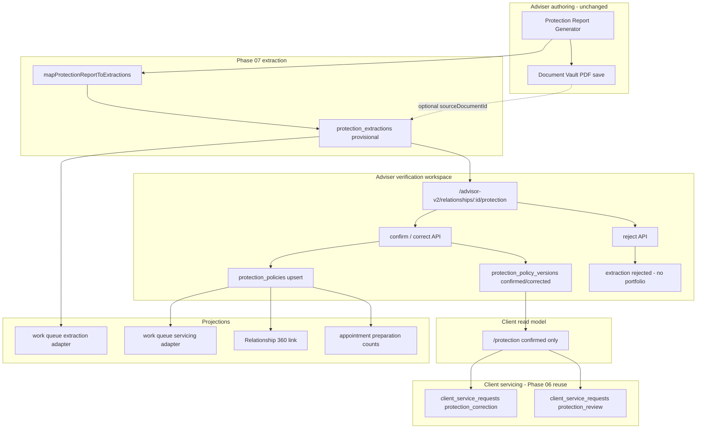

# CRM V2 Phase 07 — Protection Architecture

**Scope:** Structured protection portfolio — policy identity, versioned coverage, extraction review, client summary, work-queue projection.  
**Feature key:** `crm_v2_protection_portfolio` (single flag for adviser and client surfaces).

---

## 1. Design principles

1. **Adviser verification is mandatory** — provisional extractions never become client-visible portfolio rows without explicit confirm/correct.
2. **Vault remains document SOT** — policies link via `source_document_id`; no duplicate document store.
3. **Version immutability** — confirmed versions are superseded, not overwritten in place.
4. **Fail-closed feature gating** — master + pilot + feature flag required for adviser; client requires enabled + `client_visible`.
5. **Bounded reads** — list endpoints cap policies, versions, extractions per `lib/crm-v2/constants.ts`.
6. **Queue is projection** — work items navigate to source; adapters do not mutate policies.

---

## 2. Canonical authorities

| Authority | Table | Responsibility |
|-----------|-------|----------------|
| Policy identity | `protection_policies` | Stable logical policy per client: insurer, names, status, masked ref, source doc link, pointer to current confirmed version |
| Policy version | `protection_policy_versions` | Sum assured, premium, coverage JSON, riders, verification state, structured snapshot, version hash |
| Extraction review | `protection_extractions` | Provisional fields from report/vault/manual; adviser review status; idempotency |
| Domain events | `protection_domain_events` | Append-only audit with `safe_metadata` only |

**Not authoritative:**

- Protection report generator in-memory draft
- Work queue `AdviserWorkItem` rows
- Relationship 360 protection link label
- Appointment preparation counts
- Client service requests (servicing channel, not policy SOT)

---

## 3. End-to-end flow diagram



---

## 4. Layer architecture

```text
┌─────────────────────────────────────────────────────────────┐
│ UI                                                          │
│  ProtectionPortfolioClient (adviser)                        │
│  ClientProtectionClient (client)                              │
│  ProtectionReportClient (legacy generator - unchanged)      │
├─────────────────────────────────────────────────────────────┤
│ API routes (app/api/advisor-v2/protection/**, /api/protection/**) │
├─────────────────────────────────────────────────────────────┤
│ Service layer: lib/crm-v2/protection/protection.ts          │
│  + verificationLifecycle.ts, deduplication.ts,              │
│    extractionMapper.ts, types.ts, listQueries.ts            │
├─────────────────────────────────────────────────────────────┤
│ Access: assertCrmV2ProtectionPortfolioAccess                │
│         assertCrmV2ClientProtectionAccess                   │
├─────────────────────────────────────────────────────────────┤
│ Supabase admin client (service role) + RLS on tables        │
├─────────────────────────────────────────────────────────────┤
│ PostgreSQL: protection_* tables                             │
└─────────────────────────────────────────────────────────────┘
```

---

## 5. Non-duplication matrix

| Existing system | Relationship to Phase 07 |
|-----------------|--------------------------|
| `documents` / vault | FK only; no copy of file bytes |
| Protection report generator | Input to extraction mapper; UI not replaced |
| Discover / Shield Score | Isolated; no write path to protection tables |
| `advisor_tasks` | Not used for verification state |
| `service_commitments` | Not used for policy corrections |
| `client_service_requests` | Client correction/review channel only |
| Work queue | Read adapters; completion via navigation |
| Annual review print | Unchanged; future binder uses confirmed versions |
| Google Calendar | No protection schema changes Phase 07 |

---

## 6. Policy identity model

`protection_policies` holds **identity** fields stable across versions:

- `insurer`, `display_name`, `policy_category`, `policy_owner`, `life_assured`
- `policy_status`, `policy_ref_masked` (never full policy number in UI)
- `policy_start_date`, `maturity_or_expiry_date`
- `source_document_id` → `documents.id`
- `current_confirmed_version_id` → latest adviser-verified version
- `archived_at` for soft archive (out of active portfolio lists)
- Optimistic `version` integer for concurrent policy header updates

Category allowlist: `term_life`, `whole_life`, `endowment`, `investment_linked`, `health`, `accident`, `long_term_care`, `disability_income`, `other`.

Status allowlist: `in_force`, `lapsed`, `surrendered`, `matured`, `pending`, `unknown`.

---

## 7. Version model (summary)

Detailed in `docs/CRM_V2_PHASE_07_POLICY_VERSIONING.md`.

- Monotonic `version_number` per policy (`UNIQUE (policy_id, version_number)`)
- States share vocabulary with extraction review via `verificationLifecycle.ts`
- Portfolio-eligible: `confirmed`, `corrected` only
- Supersede on new confirm against existing policy: prior confirmed → `superseded`
- `structured_snapshot` + `version_hash` for integrity audit

---

## 8. Extraction model (summary)

Detailed in `docs/CRM_V2_PHASE_07_EXTRACTION_AND_VERIFICATION.md`.

- Created from report POST or future manual paths
- `extraction_method`: `protection_report` | `document_vault` | `manual`
- `idempotency_key` scoped per client + composite report key
- `resulting_policy_id` / `resulting_version_id` set on confirm
- Rejected extractions never appear in client portfolio

---

## 9. Access control architecture

**Adviser gate** (`assertCrmV2ProtectionPortfolioAccess`):

1. `assertCrmV2Access()` — master + pilot + allowlist
2. `isFeatureEnabled('crm_v2_protection_portfolio')`

**Client gate** (`assertCrmV2ClientProtectionAccess`):

1. Authenticated client role
2. Feature row enabled AND `client_visible = true`
3. Session-derived `client.id` — no browser-supplied client ID

**RLS** (all four protection tables):

```sql
USING (is_assigned_advisor(client_id) OR is_admin())
```

Versions policy joins parent policy for assignment check.

---

## 10. Work queue integration

| Adapter | sourceType | Triggers |
|---------|------------|----------|
| `protectionExtractionAdapter` | `protection_extraction` | `adviser_review_status` in provisional/awaiting_review |
| `protectionPolicyServicingAdapter` | `protection_policy_servicing` | Missing source doc, stale verification, upcoming expiry |

Batch load: `loadWorkQueueBatchData.ts` queries `protection_extractions` and `protection_policies`.  
Registry: `sourceRegistry.ts` marks suitability read-only.

---

## 11. Relationship 360 integration

`protectionProjection.ts` exports:

- `loadCrmProtectionFinancialPlanLink(clientId)` — label + href + status
- `loadCrmProtectionOverviewSummary(clientId)` — string for overview cards

Href pattern: `/advisor-v2/relationships/{clientId}/protection` via `buildProtectionPortfolioHref`.

---

## 12. Appointment integration

`loadProtectionAppointmentPreparation(clientId)` returns safe aggregates:

- `provisionalExtractionsAwaitingReview`
- `missingSourceDocuments`
- `clientCorrectionRequests` (open service requests)
- `upcomingPolicyExpiryOrMaturity` (90-day horizon)
- `protectionReportAvailable` (vault tag count)
- `portfolioLastVerifiedAt` / stale flag via `CRM_V2_PROTECTION_VERIFICATION_PERIOD_DAYS`

Embedded in appointment DTO as `protectionPreparation` — no raw policy numbers.

---

## 13. Deduplication architecture

`findDuplicateCandidates()` scores weak matches (insurer, category, life assured, owner, start date, masked ref).  
**No auto-merge.** Adviser chooses `matchPolicyId` on confirm to attach new version to existing policy.  
`maskPolicyNumber()` enforces `***{last4}` storage pattern.

---

## 14. Event and audit architecture

`protection_domain_events` — immutable rows:

- `event_type` free text (e.g. `extraction_created`, `version_confirmed`, `extraction_rejected`)
- `entity_type`: `policy` | `version` | `extraction`
- `actor_role`: `adviser` | `client` | `system`
- `safe_metadata` JSONB — no document paths, no full policy numbers

Cross-cutting: `writeAuditLog` on bulk extraction create (`crm_protection_extractions_created`).

---

## 15. Performance bounds

| Constant | Value | Usage |
|----------|-------|-------|
| `CRM_V2_PROTECTION_MAX_POLICIES` | 50 | Portfolio lists |
| `CRM_V2_PROTECTION_MAX_VERSIONS` | 30 | Version history |
| `CRM_V2_PROTECTION_MAX_EXTRACTIONS` | 50 | Awaiting verification |
| `CRM_V2_PROTECTION_MAX_EVENTS` | 50 | Future event panels |
| `CRM_V2_PROTECTION_STALE_DAYS` | 365 | Adviser stale badge |

Responses include `bounded: true` when truncated.

---

## 16. Module map

| Path | Role |
|------|------|
| `lib/crm-v2/protection/protection.ts` | Core CRUD and portfolio loaders |
| `lib/crm-v2/protection/verificationLifecycle.ts` | State machine |
| `lib/crm-v2/protection/extractionMapper.ts` | Report → extraction fields |
| `lib/crm-v2/protection/deduplication.ts` | Masking + candidate match |
| `lib/crm-v2/protection/types.ts` | DTOs and allowlists |
| `lib/crm-v2/protection/listQueries.ts` | Href builders |
| `lib/crm-v2/relationships/protectionProjection.ts` | R360 projection |
| `lib/work-queue/adapters/protectionExtractionAdapter.ts` | Queue projection |
| `lib/work-queue/adapters/protectionPolicyServicingAdapter.ts` | Queue projection |

---

## 17. Prohibited (architecture)

- Insurer API integration
- OCR / ML classification pipeline
- Automatic advice or product recommendations from portfolio data
- Client-side confirmation of extractions
- Remote feature enable in SQL migrations
- Generic `advisor_work_items` table
- Financial prioritisation in queue ordering from protection data

---

## 18. Cross-references

- Audit: `docs/CRM_V2_PHASE_07_EXISTING_PROTECTION_AUDIT.md`
- API: `docs/CRM_V2_PHASE_07_API_CONTRACT.md`
- Migration: `docs/CRM_V2_PHASE_07_MIGRATION_RUNBOOK.md`
- Blueprint: `docs/CRM_V2_ARCHITECTURE_BLUEPRINT.md` §5.5
