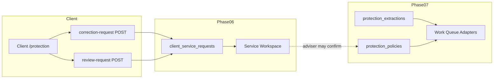

# CRM V2 Phase 07 — Service and Work Queue Integration

**Dependencies:** Phase 06 `client_service_requests`, Phase 10 work queue virtual assembly  
**Principle:** Client corrections route through service requests; work queue projects protection work read-only.

---

## 1. Service request integration

### 1.1 Extended categories (migration 202606290011)

`client_service_requests.request_category` CHECK extended:

| Category | Purpose |
|----------|---------|
| `protection_correction` | Client disputes specific confirmed policy data |
| `protection_review` | Client requests full portfolio review |

Existing Phase 06 categories unchanged: `general_enquiry`, `document_help`, `appointment_scheduling`, `account_update`, `plan_question`, `other`.

Lifecycle module: `lib/crm-v2/service/requestLifecycle.ts` includes new categories in allowlists.

### 1.2 Client correction request

**API:** `POST /api/protection/[policyId]/correction-request`

**Gates:**

1. `assertCrmV2ClientProtectionAccess()` — protection feature
2. `assertCrmV2ClientServiceAccess()` — `crm_v2_client_service` for write path

**Service call:** `createClientProtectionCorrectionRequest()`:

```typescript
await createClientServiceRequest({
  category: "protection_correction",
  summary: `Protection correction — ${displayName}`,
  details: `Category: ${category}. ${explanation}...`,
  urgency: "normal",
  idempotencyKey,
  ...
});
```

**Policy validation:** `getClientProtectionPolicyDetail()` first — unconfirmed policy returns 404.

**No mutation** of `protection_policies` or `protection_policy_versions` on client POST.

### 1.3 Client review request

**API:** `POST /api/protection/review-request`

Same dual gate pattern. Category `protection_review`. Summary: "Protection portfolio review requested".

### 1.4 Adviser servicing workspace

Adviser views open requests via Phase 06 Service workspace:

- Route: `/advisor-v2/service` → Client Requests view
- Adapter: `clientServiceRequestAdapter` (unchanged Phase 06)
- Resolution: adviser transitions request lifecycle — separate from protection confirm workflow

**Workflow separation:**

```text
Client correction request → service request (Phase 06)
Adviser investigates → may create new extraction OR correct via confirm API
Confirm API → mutates protection tables (Phase 07)
Resolve service request → Phase 06 transition only
```

### 1.5 Appointment preparation counts

`loadProtectionAppointmentPreparation()` queries open protection service requests:

```typescript
.from("client_service_requests")
.eq("client_id", clientId)
.in("request_category", ["protection_correction", "protection_review"])
.in("lifecycle_status", ["submitted", "acknowledged", "in_progress", "waiting_on_client"])
```

Exposes `clientCorrectionRequests` count and `protectionReviewRequested` boolean — safe aggregates for meeting prep DTO.

---

## 2. Work queue adapters

### 2.1 Registration

`lib/work-queue/adapters/index.ts`:

```typescript
import { protectionExtractionAdapter } from "./protectionExtractionAdapter";
import { protectionPolicyServicingAdapter } from "./protectionPolicyServicingAdapter";

// Included in default adapter list and registry
```

`lib/work-queue/sourceRegistry.ts` entries:

| sourceType | adapterName | canCompleteInQueue |
|------------|-------------|-------------------|
| `protection_extraction` | `protectionExtractionAdapter` | **false** |
| `protection_policy_servicing` | `protectionPolicyServicingAdapter` | **false** |

### 2.2 protectionExtractionAdapter

**Source rows:** `batchData.protectionExtractions`

**Load query** (`loadWorkQueueBatchData.ts`):

```sql
FROM protection_extractions
WHERE adviser_review_status IN ('provisional', 'awaiting_review')
  AND adviser_user_id = :adviserId  -- book scope
ORDER BY created_at DESC
LIMIT ...
```

**Work item shape:**

| Field | Value |
|-------|-------|
| `sourceType` | `protection_extraction` |
| `id` | deterministic hash of source type + extraction id |
| `clientId` | From row |
| `summary` | "Provisional protection extraction awaiting verification" |
| `urgency` | Normal (no wealth-based prioritisation) |
| `actionHref` | `/advisor-v2/relationships/{clientId}/protection?extractionId={id}` |
| `dueAt` | null or created_at based |

**Read-only:** `load()` only — no `complete()` mutator.

### 2.3 protectionPolicyServicingAdapter

**Source rows:** `batchData.protectionPolicyServicing`

**Load query:** policies with servicing signals:

- Missing `source_document_id`
- Stale verification (`confirmed_at` older than `CRM_V2_PROTECTION_STALE_DAYS`)
- Upcoming `maturity_or_expiry_date` within 90 days

**Work item:**

| Field | Value |
|-------|-------|
| `sourceType` | `protection_policy_servicing` |
| `summary` | Contextual label (missing source, stale, expiry) |
| `actionHref` | `/advisor-v2/relationships/{clientId}/protection` |

**Read-only:** navigation to portfolio workspace; mutations happen in protection APIs only.

### 2.4 Batch data types

`lib/work-queue/batchData.ts`:

```typescript
protectionExtractions: WorkQueueProtectionExtractionRow[];
protectionPolicyServicing: WorkQueueProtectionPolicyServicingRow[];
```

Defaults empty arrays in fixtures for tests.

### 2.5 Queue completion prohibition

Validation script asserts:

- Adapters registered
- No queue path calls `confirmProtectionExtraction` directly
- User must open `actionHref` and complete verification in portfolio UI/API

This matches Phase 10 pattern: queue is wayfinding, not alternate write authority.

---

## 3. Feature gating interaction

| Surface | Flags required |
|---------|----------------|
| Work queue protection items | Items appear when data exists; adviser CRM access + assignment |
| Protection portfolio UI | `crm_v2_protection_portfolio` + master + pilot |
| Client correction POST | `crm_v2_protection_portfolio` + `crm_v2_client_service` |

Queue may show extraction items only after migration applied and extractions exist — adapter queries fail gracefully if tables missing (pre-migration).

---

## 4. Relationship 360 integration

`protectionProjection.ts` — not a work queue adapter but parallel projection:

- Financial plan tab link to portfolio route
- Status label includes pending extraction count

Loaded in `readModel.ts` alongside service projections.

---

## 5. Service commitment rejection

Phase 07 does **not** create `service_commitments` for:

- Policy verification tasks
- Extraction review tasks

Use work queue extraction adapter instead. Avoids duplicate open work records.

---

## 6. Idempotency on client requests

Correction/review POST accepts `idempotencyKey` forwarded to `createClientServiceRequest` Phase 06 idempotency index.

Prevents duplicate tickets on double-submit.

---

## 7. Notification behavior

Phase 07 does not add email/SMS for protection events.

In-app notifications follow Phase 06 patterns if service request creation emits them — non-blocking.

---

## 8. Data flow diagram



---

## 9. Testing references

Manual tests 13, 17, 29–30 in `docs/CRM_V2_PHASE_07_MANUAL_TESTS.md`.

Validation: `work queue adapters registered`, `service request categories extended`.

---

## 10. Cross-references

- Client routes: `docs/CRM_V2_PHASE_07_CLIENT_PROTECTION_SUMMARY.md`
- Architecture: `docs/CRM_V2_PHASE_07_PROTECTION_ARCHITECTURE.md`
- Phase 06 service: `docs/CRM_V2_PHASE_06_SERVICE_ARCHITECTURE.md`
