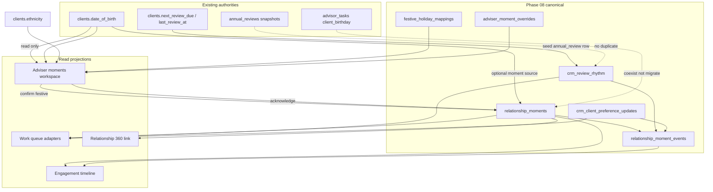

# CRM V2 Phase 08 — Relationship Moments Architecture

**Branch:** `crm-v2-08-relationship-moments`  
**Feature key:** `crm_v2_relationship_moments`  
**Domain service:** `lib/crm-v2/moments/moments.ts`

---

## 1. Purpose

Phase 08 introduces a structured **relationship moments engine** for advisers to track birthdays, anniversaries, festive greetings, review cadence, and client preference signals — without duplicating existing authorities (`clients.date_of_birth`, `advisor_tasks`, `annual_reviews`).

```text
RELATIONSHIP (clients) → MOMENTS (relationship_moments) → ENGAGEMENT (timeline projection)
                      → REVIEW RHYTHM (crm_review_rhythm projection)
                      → CLIENT PREFERENCES (crm_client_preference_updates)
```

---

## 2. Canonical authorities

### 2.1 `relationship_moments`

| Field group | Key columns |
|-------------|-------------|
| Identity | `id`, `client_id`, `adviser_user_id` |
| Moment | `moment_type`, `title`, `moment_date`, `recurrence_rule`, `timezone` |
| Lifecycle | `confirmation_state`, `active`, `deactivated_at`, `last_acknowledged_at`, `next_occurrence_date` |
| Privacy | `visibility`, `sensitivity_class`, `reminder_preference` |
| Provenance | `source_type`, `source_id`, `idempotency_key` |
| Links | `holiday_key`, `linked_appointment_id`, `linked_commitment_id` |
| Concurrency | `version`, `created_at`, `updated_at` |

**Moment types (allowlisted):** `birthday`, `wedding_anniversary`, `child_birthday`, `policy_anniversary`, `review_anniversary`, `festive_greeting`, `client_preference`, `life_event_follow_up`, `custom_adviser_reminder`.

**Source types:** `manual`, `client_profile_dob`, `client_preference`, `festive_suggestion`, `review_rhythm`, `policy`, `appointment`, `service_commitment`.

**Confirmation states:** `confirmed`, `suggested`, `rejected`, `pending_client`.

**Idempotency:** unique index on `(client_id, idempotency_key)` WHERE `active = true` AND `idempotency_key IS NOT NULL`.

### 2.2 `adviser_moment_overrides`

Per-adviser, per-client, per-holiday include/exclude for festive suggestions.

| Column | Purpose |
|--------|---------|
| `holiday_key` | FK → `festive_holiday_mappings` |
| `override_action` | `include` or `exclude` |
| Unique | `(adviser_user_id, client_id, holiday_key)` |

**Precedence:** adviser override wins over ethnicity mapping. `exclude` suppresses suggestion; `include` forces suggestion even when ethnicity mapping would not match.

### 2.3 `festive_holiday_mappings`

Read-only reference configuration (seeded in migration, RLS SELECT for all authenticated).

| holiday_key | display_name | ethnicity_keys | notes |
|-------------|--------------|----------------|-------|
| `cny` | Chinese New Year | chinese | lunar |
| `hari_raya` | Hari Raya Aidilfitri | malay | lunar |
| `deepavali` | Deepavali | indian | lunar |
| `christmas` | Christmas | eurasian, mixed, other | fixed Dec 25 |

Module: `lib/crm-v2/moments/festiveSuggestions.ts`.

### 2.4 `relationship_moment_events`

Immutable audit stream for moments domain. Entity types: `moment`, `review_rhythm`, `preference_update`, `override`. Event types include `moment_created`, `moment_acknowledged`, `suggestion_confirmed`, `review_rhythm_updated`, `client_preference_submitted`, `review_requested`.

---

## 3. Flow diagram



---

## 4. Adviser workspace

| Route | `/advisor-v2/relationships/[relationshipId]/moments` |
| Component | `components/aegis/advisor-v2/moments/RelationshipMomentsClient.tsx` |
| API | `GET/POST /api/advisor-v2/relationships/[relationshipId]/moments` |

**Views** (`?view=`): `upcoming`, `important_dates`, `review_rhythm`, `client_preferences`, `festive_suggestions`, `past_acknowledgements`, `data_quality`.

**DTO:** `AdviserMomentsWorkspaceDto` in `lib/crm-v2/moments/types.ts` — bounded lists (`CRM_V2_MOMENTS_MAX_ITEMS = 50`).

---

## 5. Lifecycle operations

| Operation | API | Service function |
|-----------|-----|------------------|
| Create moment | POST `.../moments` | `createRelationshipMoment` |
| Update moment | PATCH `.../moments/[momentId]` | `updateRelationshipMoment` |
| Acknowledge | POST `.../moments/[momentId]/acknowledge` | `acknowledgeRelationshipMoment` |
| Deactivate | POST `.../moments/[momentId]/deactivate` | `deactivateRelationshipMoment` |
| Confirm festive | UI → POST moment | `confirmFestiveSuggestion` (idempotency `festive:{holidayKey}`) |

Lifecycle rules: `lib/crm-v2/moments/lifecycle.ts`.

---

## 6. Non-duplication rules

| Domain | Authority | Phase 08 role |
|--------|-----------|---------------|
| Birthday fact | `clients.date_of_birth` | Projected into workspace; optional `relationship_moments` row |
| Birthday task | `advisor_tasks` | Coexist; not migrated |
| Review due date | `clients.next_review_due` | Seeds `crm_review_rhythm.next_due_date` |
| Review artefact | `annual_reviews` | Unchanged |
| Festive config | `festive_holiday_mappings` | Read-only seed |
| Client ethnicity | `clients.ethnicity` | Festive suggestions only |

---

## 7. Integration points

| Consumer | Module | Behaviour |
|----------|--------|-----------|
| Relationship 360 | `momentsProjection.ts` | Engagement link with moment count summary |
| Timeline | `timelineProjection.ts` | Safe `relationship_moment_events` entries — no ethnicity text |
| Work queue | Three adapters | Read-only deep links |
| Notifications | `notifications.ts` | In-app only via `dbCreateClientNotification` |
| Service requests | `requestLifecycle.ts` | Categories `preference_update`, `review_request` |

---

## 8. RLS pattern

All Phase 08 tables except `festive_holiday_mappings` (read-only) use assignment-scoped policies:

```sql
USING (is_assigned_advisor(client_id) OR is_admin())
```

`crm_client_preference_updates` additionally allows client own-row access for submit flows.

---

## 9. Feature gating

`assertCrmV2RelationshipMomentsAccess()` requires:

```text
requireAdvisorAccess()
  → crm_v2_master
  → crm_v2_pilot_mode
  → CRM_V2_PILOT_USER_IDS allowlist
  → crm_v2_relationship_moments
```

Fail-closed: disabled flag returns 403 with no workspace data load.
