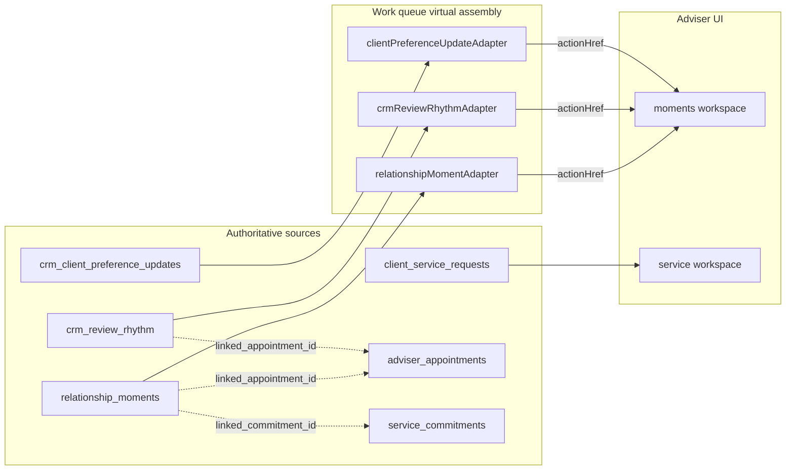

# CRM V2 Phase 08 — Service, Appointment and Work Queue Integration

**Scope:** Phase 06 service requests, Phase 03 appointments, Phase 10.2 work queue — Phase 08 additions only.

---

## 1. Service request extensions

Migration `202606290013` extends `client_service_requests.request_category` CHECK:

| New category | Trigger | Handler |
|--------------|---------|---------|
| `preference_update` | Client PATCH `/api/preferences` (future adviser-approved apply) | Service workspace Client Requests |
| `review_request` | Client POST `/api/preferences/review-request` | `requestClientReview()` in `moments.ts` |

Module: `lib/crm-v2/service/requestLifecycle.ts` — allowlists `preference_update` and `review_request`.

**Authority:** `client_service_requests` remains Phase 06 SOT. Moments domain does not create a parallel request table.

```text
Client POST /api/preferences/review-request
  → createClientServiceRequest(category: review_request)
  → client_service_requests row
  → notifyClientRequestedReview (in-app)
  → relationship_moment_events (review_requested)
```

---

## 2. Appointment linkage

`relationship_moments.linked_appointment_id` → FK `adviser_appointments(id) ON DELETE SET NULL`

`crm_review_rhythm.linked_appointment_id` → same FK

**Use cases:**

- Adviser links review rhythm row to scheduled annual review appointment
- Moment card deep-link to appointment detail (future UI enhancement)
- No automatic appointment creation from moment acknowledgement

**Non-goals:**

- No Google Calendar event creation from moments in Phase 08
- No appointment lifecycle transition triggered by moment acknowledge

Appointment preparation cards (Phase 03/07) are **unchanged** — protection prep counts remain separate from moments.

---

## 3. Service commitment linkage

`relationship_moments.linked_commitment_id` → FK `service_commitments(id) ON DELETE SET NULL`

**Use cases:**

- Tie `life_event_follow_up` or `custom_adviser_reminder` moment to an open commitment
- Source type `service_commitment` available for provenance tracking

No auto-creation of commitments from moments — adviser explicit action only.

---

## 4. Work queue adapters (read-only)

Phase 08 registers three adapters in `lib/work-queue/adapters/index.ts`:

### 4.1 `relationshipMomentAdapter`

| Field | Value |
|-------|-------|
| `sourceType` | `relationship_moment` |
| Batch loader | `loadRelationshipMoments()` in `loadWorkQueueBatchData.ts` |
| Filter | `requiresAction === true`, assignment-scoped clients |
| Category | `task` |
| Priority | `normal` (fixed) |
| `actionHref` | `/advisor-v2/relationships/{clientId}/moments?momentId={id}` |
| Metadata | `{}` — no ethnicity, no premium data |

### 4.2 `crmReviewRhythmAdapter`

| Field | Value |
|-------|-------|
| `sourceType` | `crm_review_rhythm` |
| Batch loader | `loadCrmReviewRhythms()` |
| Filter | status `scheduled` or `overdue` |
| Category | `review` |
| Reason codes | `review_overdue`, `review_due_soon` |
| `actionHref` | `/advisor-v2/relationships/{clientId}/moments?view=review_rhythm` |

### 4.3 `clientPreferenceUpdateAdapter`

| Field | Value |
|-------|-------|
| `sourceType` | `client_preference_update` |
| Batch loader | `loadClientPreferenceUpdates()` |
| Filter | `status === pending_review` |
| Category | `task` |
| `actionHref` | `/advisor-v2/relationships/{clientId}/moments?view=client_preferences` |

---

## 5. Source registry

`lib/work-queue/sourceRegistry.ts` entries:

```text
relationship_moment
crm_review_rhythm
client_preference_update
```

Batch data types in `lib/work-queue/batchData.ts` extended for Phase 08 row shapes.

---

## 6. Integration diagram



---

## 7. Prohibited queue behaviours

| Prohibited | Enforcement |
|------------|-------------|
| Queue mutates moments | Adapters implement `load()` only — no complete handler |
| Ethnicity-based priority | `applyPriorityToItem({ priority: "normal" })` |
| Auto-dismiss on navigation | `dismissible: false` |
| Cross-adviser items | `allowedClientIds` filter in each adapter |

---

## 8. Coexistence with Phase 06/07 adapters

Existing adapters unchanged:

- `serviceCommitmentAdapter`
- `clientServiceRequestAdapter`
- `protectionExtractionAdapter`
- `protectionPolicyServicingAdapter`
- `advisorTaskAdapter` (includes legacy `client_birthday` tasks)

Today homepage (Phase 11) will assemble all adapters; Phase 08 registers hooks without enabling `crm_v2_today`.

---

## 9. Allowlisted href extension

Work queue `actionHref` values use `/advisor-v2/relationships/**` — covered by Phase 11 `isAllowlistedWorkQueueHref` extension documented in `docs/CRM_V2_ROUTE_MAP.md`.

---

## 10. Testing notes

Manual tests 17–18, 29–30 in `docs/CRM_V2_PHASE_08_MANUAL_TESTS.md` cover queue read-only behaviour and service request category extension.

Automated validation: `scripts/run-crm-v2-relationship-moments-validation.ts` asserts adapter registration and batch loaders.
