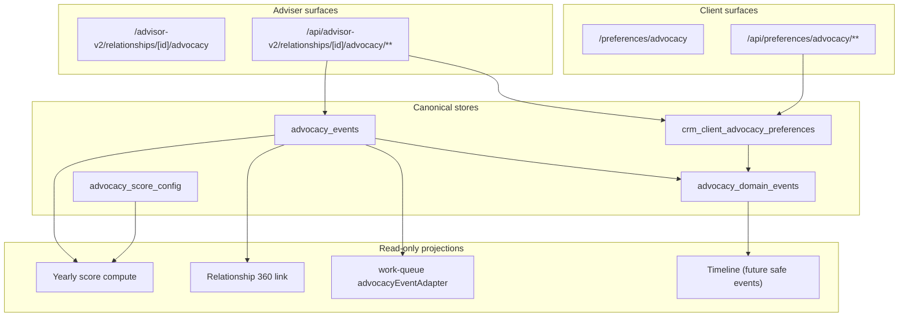

# CRM V2 Phase 09 — Advocacy Architecture

**Branch:** `crm-v2-09-advocacy`  
**Feature key:** `crm_v2_advocacy` (single key; `adviser_visible=true`, `client_visible=true`, default disabled)  
**Principle:** Event-based advocacy layer with consent awareness and non-ranking yearly score projection.

---

## 1. Design goals

| Goal | Implementation |
|------|----------------|
| Single advocacy authority | `advocacy_events` append-only records |
| Consent-aware operations | `consent_state` per event + `crm_client_advocacy_preferences` |
| Transparent yearly score | `computeAdvocacyYearScore()` from eligible events + `advocacy_score_config` |
| No sales ranking | Score and events never drive queue priority or client segmentation |
| Assignment-scoped access | RLS + `resolveAccessibleClient` |
| Immutable audit | `advocacy_domain_events` append-only |

---

## 2. Canonical tables

### 2.1 `advocacy_events` (SOT)

Primary authority for introductions, referrals, testimonials workflow markers, thank-yous, and consent-related adviser actions.

| Field group | Purpose |
|-------------|---------|
| Identity | `id`, `client_id`, `adviser_user_id` |
| Event | `event_type`, `event_date`, `safe_title`, `notes` |
| Consent | `consent_state`, `visibility` |
| Referral | `referred_person_label`, `has_contact_details` |
| Follow-up | `follow_up_status`, `next_follow_up_date` |
| Links | `linked_appointment_id`, `linked_service_request_id`, `linked_relationship_moment_id` |
| Score | `points`, `score_eligible`, `active` |
| Integrity | `version`, `idempotency_key`, `source_type`, `source_id` |

**Event types (allowlisted):** `introduction_offered`, `introduction_made`, `referral_received`, `referral_contacted`, `referral_declined`, `testimonial_offered`, `testimonial_consented`, `testimonial_withdrawn`, `review_requested`, `review_completed`, `client_feedback_received`, `permission_to_mention_granted`, `permission_withdrawn`, `thank_you_sent`, `do_not_ask_recorded`.

**Lifecycle:** Updates via PATCH; soft deactivate via transition `deactivate` (sets `active=false`, `deactivated_at`). No hard DELETE for advisers.

### 2.2 `advocacy_score_config` (SOT — operator read)

| Column | Purpose |
|--------|---------|
| `config_key` | Stable seed key |
| `event_type` | Maps to advocacy event type |
| `points` | Default points per event |
| `category_cap` | Per-type yearly cap |
| `max_yearly_score` | Global yearly cap (50 in seeds) |
| `active`, `version` | Operator toggles |

Advisers have SELECT-only RLS. Weights are not client-editable.

### 2.3 `crm_client_advocacy_preferences` (SOT)

Per-client consent and opt-out aggregate:

| Column | Purpose |
|--------|---------|
| `testimonial_consent` | `not_required`, `pending`, `granted`, `limited`, `withdrawn`, `declined`, `unknown` |
| `referral_ask_opt_out` | Client declines referral asks |
| `permission_to_mention` | Permission to mention client by name |
| `do_not_ask` | Blocks adviser-initiated `introduction_offered` |
| `version` | Optimistic concurrency |

### 2.4 `advocacy_domain_events` (SOT — immutable audit)

Append-only domain log: `advocacy_event_created`, `consent_granted`, `consent_withdrawn`, `referral_outcome_updated`, `testimonial_permission_updated`, `thank_you_recorded`, `advocacy_event_deactivated`, `do_not_ask_recorded`.

`safe_metadata` JSONB — bounded, no raw PII dumps.

---

## 3. Domain layer

| Module | Responsibility |
|--------|----------------|
| `lib/crm-v2/advocacy/advocacy.ts` | Workspace load, CRUD, client preferences |
| `lib/crm-v2/advocacy/lifecycle.ts` | Transition validation, consent rules |
| `lib/crm-v2/advocacy/score.ts` | Yearly score computation |
| `lib/crm-v2/advocacy/restrictions.ts` | Allowed/prohibited score uses |
| `lib/crm-v2/advocacy/types.ts` | DTOs and allowlists |
| `lib/crm-v2/advocacy/notifications.ts` | In-app notifications only |
| `lib/crm-v2/relationships/advocacyProjection.ts` | Relationship 360 engagement link |

---

## 4. Flow diagram

---

## 5. Workspace views

Adviser workspace (`AdviserAdvocacyWorkspaceDto`) partitions active events into:

| View | Filter |
|------|--------|
| `history` | All active events (default) |
| `introductions` | Introduction event types |
| `referrals` | Referral event types |
| `testimonials` | Testimonial event types |
| `follow_up` | `follow_up_status` pending/overdue |
| `consent` | Consent-pending or withdrawn states |
| `summary` | Score + preference summary |

Bounded at `CRM_V2_ADVOCACY_MAX_ITEMS` (50).

---

## 6. Non-ranking rules

| Rule | Enforcement |
|------|-------------|
| Score not in work-queue priority | `advocacyEventAdapter` sets `priority: "normal"` always |
| Score not in client DTOs | `advocacyScoreMustNotAppearInClientDto()` |
| Score not in relationship list | Visibility model §2.1 |
| No sales leaderboards | No ranking schema or APIs |
| No campaign automation | No outbound campaign tables |
| No Promotions integration | 9F.4 observation continues; no `promotions` writes |

---

## 7. Integration links (non-authoritative)

| Source | Link field | Direction |
|--------|------------|-----------|
| `adviser_appointments` | `linked_appointment_id` | Context only |
| `client_service_requests` | `linked_service_request_id` | Context only |
| `relationship_moments` | `linked_relationship_moment_id` | Context only |
| `adviser_feedback` | `source_type` + `source_id` | Reference only |

Links do not mutate source records.

---

## 8. Feature gate

**Single key:** `crm_v2_advocacy`

| Surface | Gate |
|---------|------|
| Adviser APIs | `assertCrmV2AdvocacyAccess()` — master + pilot + allowlist + `crm_v2_advocacy` |
| Client APIs | `assertCrmV2ClientAdvocacyAccess()` — client role + `crm_v2_advocacy` enabled **and** `client_visible` |

There is **no** separate `crm_v2_client_advocacy` key.

---

## 9. Explicit exclusions

- Promotions Stage 6 schema retirement
- Marketing campaign engine
- Referral CRM / lead scoring product
- Cross-adviser advocacy leaderboards
- Automatic testimonial publication from advocacy events (仍 uses `adviser_feedback` approval path for public display)
