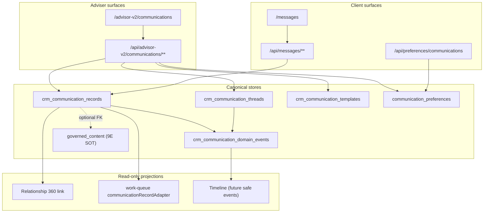

# CRM V2 Phase 10 — Communications Architecture

**Branch:** `crm-v2-10-communications`  
**Feature key:** `crm_v2_communications` (single key; `adviser_visible=true`, `client_visible=true`, default disabled)  
**Principle:** Governed adviser drafts and communication logs with consent awareness — draft or log only, no automatic external send.

---

## 1. Design goals

| Goal | Implementation |
|------|----------------|
| Single operational authority | `crm_communication_records` for drafts, logs, and client-visible messages |
| Thread grouping | `crm_communication_threads` per client/source context |
| Governed templates | `crm_communication_templates` with compliance status and version |
| Published content SOT unchanged | `governed_content` (Phase 9E) via optional FK only |
| Consent-aware operations | Extended `communication_preferences` + `preferenceWarnings` on DTOs |
| No automated outreach | `channelAllowsAutoSend()` always false; transitions log only |
| Assignment-scoped access | RLS + `resolveAccessibleClient` |
| Immutable audit | `crm_communication_domain_events` append-only |

---

## 2. Canonical tables

### 2.1 `crm_communication_threads` (SOT — grouping)

Groups communication activity by client and optional source context.

| Field group | Purpose |
|-------------|---------|
| Identity | `id`, `client_id`, `adviser_user_id`, `assigned_adviser_user_id` |
| Context | `thread_type` (`relationship`, `source_linked`, `client_inbox`), `source_type`, `source_id` |
| Display | `subject`, `channel`, `visibility`, `status` |
| Activity | `last_activity_at`, `version` |

Threads are created automatically when an adviser creates a draft or log. `source_linked` when `source_type`/`source_id` provided.

### 2.2 `crm_communication_records` (SOT — operational records)

Primary authority for adviser drafts, external-channel drafts, call logs, and client-visible messages.

| Field group | Purpose |
|-------------|---------|
| Identity | `id`, `client_id`, `thread_id` |
| Source link | `source_type`, `source_id` (optional FK context) |
| Content | `channel`, `direction`, `safe_subject`, `safe_body` |
| Lifecycle | `lifecycle_status`, `delivery_state`, `active` |
| Template | `template_id`, `template_version` |
| Visibility | `client_visibility`, `consent_basis` |
| Follow-up | `follow_up_status`, `next_follow_up_date` |
| Governance | `governed_content_id` (optional link to 9E) |
| Integrity | `version`, `idempotency_key`, actor columns (`created_by`, `reviewed_by`, `sent_by`) |

**Channels (allowlisted):** `internal_client_message`, `in_app_notification`, `email_draft`, `phone_call_log`, `meeting_note_reference`, `whatsapp_draft`, `sms_draft`, `external_message_log`.

**Lifecycle statuses:** `draft`, `pending_review`, `approved`, `sent`, `logged`, `received`, `failed`, `cancelled`, `archived`.

**Directions:** `outbound`, `inbound`, `internal`.

### 2.3 `crm_communication_templates` (SOT — governed wording)

| Column | Purpose |
|--------|---------|
| `template_key`, `version` | Unique versioned template identity |
| `category` | Business use case (appointment prep, service update, etc.) |
| `channel`, `title`, `body` | Renderable content |
| `variable_schema` | JSONB array of allowed variable names |
| `compliance_status` | `draft`, `pending_review`, `approved`, `restricted`, `inactive` |
| `approved_by_user_id`, `active` | Operator governance |

Seeds in migration `202606290017`: three approved templates (`appointment_preparation_v1`, `service_request_update_v1`, `general_service_update_v1`).

### 2.4 `communication_preferences` (SOT — extended)

Phase 9E table extended with CRM V2 columns:

| New column | Purpose |
|------------|---------|
| `preferred_channel` | Client channel preference |
| `do_not_contact` | Hard block on adviser-initiated outreach |
| `festive_acknowledgement_opt_out` | Blocks festive-style acknowledgements |
| `client_message_visibility` | `visible` or `archived_local` |
| `last_confirmed_at` | Preference confirmation timestamp |
| `version` | Optimistic concurrency |

### 2.5 `crm_communication_domain_events` (SOT — immutable audit)

Append-only domain log.

**Entity types:** `communication_thread`, `communication_record`, `communication_template`, `communication_preference`.

**Event types:** `draft_created`, `template_rendered`, `draft_updated`, `review_requested`, `approved`, `sent_or_logged`, `failed`, `archived`, `client_replied`, `preference_conflict_recorded`, `follow_up_scheduled`, `follow_up_completed`, `cancelled`, `received`.

`safe_metadata` JSONB — bounded, no raw PII dumps.

---

## 3. Lifecycle state machine

```text
draft ──submit_review──► pending_review ──approve──► approved
  │                          │                         │
  │ mark_logged              │ cancel                    ├─mark_sent──► sent ──mark_failed──► failed
  ▼                          ▼                         ├─mark_logged──► logged
logged                       cancelled                   └─cancel──► cancelled
  │                          │
  └─archive──► archived      └─archive──► archived

received ──archive──► archived
failed ──submit_review──► pending_review
```

**Editable statuses:** `draft`, `pending_review` only (PATCH allowed).

**Client-visible statuses:** `sent`, `logged`, `received` when `client_visibility` IN (`client_visible`, `both`).

**Auto-log on create:** `phone_call_log` and `external_message_log` channels create records with `lifecycle_status=logged` immediately.

**No auto-send:** `mark_sent` and `mark_logged` set `delivery_state=logged_only`; no email provider invocation.

---

## 4. Domain layer

| Module | Responsibility |
|--------|----------------|
| `lib/crm-v2/communications/communications.ts` | Workspace load, CRUD, transitions, client inbox, preferences |
| `lib/crm-v2/communications/lifecycle.ts` | Transition validation, editable/client-visible rules |
| `lib/crm-v2/communications/channels.ts` | Channel capabilities; `canAutoSend: false` everywhere |
| `lib/crm-v2/communications/templates.ts` | Variable allowlist, render, escape |
| `lib/crm-v2/communications/restrictions.ts` | Prohibited uses, preference warnings |
| `lib/crm-v2/communications/notifications.ts` | In-app client notifications only |
| `lib/crm-v2/communications/types.ts` | DTOs and allowlists |
| `lib/crm-v2/communications/routes.ts` | Href builders and view parsing |
| `lib/crm-v2/relationships/communicationsProjection.ts` | Relationship 360 engagement link |

---

## 5. Adviser workspace views

| View key | Filter |
|----------|--------|
| `drafts` | `lifecycle_status = draft` |
| `needs_review` | `lifecycle_status = pending_review` |
| `recent` | `sent`, `logged`, `received` |
| `follow_ups` | `follow_up_status` IN (`pending`, `overdue`) |
| `action_required` | `failed` OR `preference_conflict` label |
| `templates` | Active approved templates |
| `preferences` | Per-relationship preference read |

**Route:** `/advisor-v2/communications`  
**Bounded:** `CRM_V2_COMMUNICATIONS_MAX_ITEMS` (list truncation with `bounded: true`).

---

## 6. Flow diagram



---

## 7. Notifications

| Trigger | Type | Channel |
|---------|------|---------|
| Client-visible message transition | `crm_client_message` | In-app only |
| Client preference update | `communication_preference_updated` | In-app only |
| Client reply | `crm_client_reply_received` | In-app only |

Notification failure is non-blocking — authoritative transition still commits.

---

## 8. Explicit prohibitions

| Prohibition | Enforcement |
|-------------|-------------|
| Automatic external send | `channelAllowsAutoSend()` false; no Resend/SMS/WhatsApp calls |
| Campaign automation | No scheduler tables or batch send jobs |
| Promotions Stage 6 | No DROP migrations |
| Advocacy score priority | Not in schema; work queue `priority: normal` |
| Auto outreach from source events | Source links are contextual only — no triggers on appointment/moment creation |

---

## 9. Relationship to Phase 9E

| Phase 9E artifact | Phase 10 relationship |
|-------------------|----------------------|
| `governed_content` | SOT for published content; optional `governed_content_id` on records |
| `communication_deliveries` | Unchanged; 9E email delivery only |
| `communication_preferences` | Extended columns; same table |
| Insights feed | Separate surface; not replaced by `/messages` |

**Branch:** `crm-v2-10-communications`
