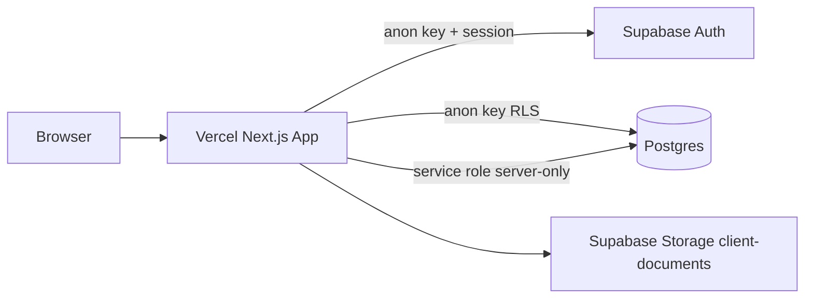

# Vercel + Supabase Deployment — Phase 4S

**Date:** 2026-06-10  
**Purpose:** Step-by-step guide for first production-style deployment of Aegis Wealth OS on Vercel with Supabase as the backend.

**Related:** [Deployment Checklist](./DEPLOYMENT_CHECKLIST.md) · [Environment Variables](./ENVIRONMENT_VARIABLES.md) · [Supabase Production Setup](./SUPABASE_PRODUCTION_SETUP.md) · [Post-Deployment QA](./POST_DEPLOYMENT_QA.md)

---

## Architecture overview



- **Public env vars** (`NEXT_PUBLIC_SUPABASE_*`) ship to the browser for auth and RLS-scoped queries.
- **Service role** stays on Vercel server runtime only for admin operations, health checks, and trusted server paths.
- **Middleware** (`middleware.ts`) refreshes sessions and gates unauthenticated access to protected routes.

---

## Prerequisites

- [ ] GitHub repository with the app code
- [ ] Supabase project configured per [Supabase Production Setup](./SUPABASE_PRODUCTION_SETUP.md)
- [ ] Migrations applied to target database
- [ ] Local checks pass:

```bash
npm run deploy:check
npm run build
npx tsc --noEmit
```

---

## Step 1 — Push to GitHub

```bash
git add .
git commit -m "Prepare for Vercel deployment"
git push origin main
```

Use your default branch name if not `main`.

---

## Step 2 — Import project into Vercel

1. Go to [vercel.com/new](https://vercel.com/new).
2. Import the GitHub repository.
3. **Framework Preset:** Next.js (auto-detected).
4. **Root Directory:** repository root (default).
5. **Build Command:** `npm run build` (default).
6. **Output Directory:** Next.js default (`.next`).
7. **Install Command:** `npm install` (default).

Do not deploy yet — configure environment variables first.

---

## Step 3 — Set environment variables

In Vercel → **Settings → Environment Variables**, add:

| Name | Value source | Scopes |
|------|--------------|--------|
| `NEXT_PUBLIC_SUPABASE_URL` | Supabase → Settings → API → Project URL | Production, Preview |
| `NEXT_PUBLIC_SUPABASE_ANON_KEY` | Supabase → Settings → API → anon public | Production, Preview |
| `SUPABASE_SERVICE_ROLE_KEY` | Supabase → Settings → API → service_role **secret** | Production, Preview |

Optional:

| Name | When to set |
|------|-------------|
| `BASE_URL` | Set to production URL when running `qa:smoke` against deployed host |
| `NEXT_PUBLIC_APP_URL` | Canonical public URL if you need a fixed client-side base (optional) |

Mark `SUPABASE_SERVICE_ROLE_KEY` as sensitive. **Never** create `NEXT_PUBLIC_SUPABASE_SERVICE_ROLE_KEY`.

Run locally before promoting:

```bash
npm run deploy:config -- --production
```

---

## Step 4 — Configure Supabase Auth for Vercel URLs

In Supabase → **Authentication → URL Configuration**:

| Setting | Value |
|---------|-------|
| Site URL | `https://<production-domain>` |
| Redirect URLs | `http://localhost:3000/auth/callback` |
| | `https://<production-domain>/auth/callback` |
| | `https://*-<team>.vercel.app/auth/callback` (preview pattern) |
| Signup paths | `.../signup` for each origin above |

See [Supabase Production Setup](./SUPABASE_PRODUCTION_SETUP.md) for invitation email notes.

---

## Step 5 — Deploy

1. Click **Deploy** (or push to the connected branch to trigger CI).
2. Open **Build Logs** — confirm:
   - Dependencies install cleanly
   - `next build` completes without type errors
   - No env var missing errors in build output
3. Note the **Production URL** and **Preview URL** from the deployment summary.

---

## Step 6 — Post-deploy verification

1. Open production URL — home page loads.
2. `GET /api/health/supabase` returns `ok: true` (or 503 if DB misconfigured — investigate).
3. Complete [Post-Deployment QA](./POST_DEPLOYMENT_QA.md).
4. Run smoke tests against production:

```bash
BASE_URL=https://<your-production-url> npm run qa:smoke
```

---

## Vercel-specific notes

### Preview deployments

- Each PR gets a unique preview URL — add patterns to Supabase redirect allow-list.
- Use a **staging Supabase project** for previews, or accept preview traffic against production Supabase (not recommended for write tests).

### `NODE_ENV` and `VERCEL_ENV`

Vercel sets these automatically. The health endpoint reduces diagnostic detail when `NODE_ENV=production` or `VERCEL_ENV=production`.

### Rate limiting limitation

The app uses **in-memory** rate limiting (`lib/security/rateLimit.ts`). On Vercel, serverless functions may run multiple concurrent instances — limits are **per instance**, not global. Documented limitation: upgrade to Redis, Vercel KV, or edge rate limiting before high-traffic multi-instance production.

### Health endpoints in production

Consider restricting public access to `/api/health/supabase` and `/supabase-health` via WAF or Vercel firewall rules after initial validation.

---

## Rollback

1. Vercel → **Deployments** → select previous successful deployment → **Promote to Production**.
2. Ensure database migrations are **backward compatible** with the rolled-back app version.
3. Re-run [Post-Deployment QA](./POST_DEPLOYMENT_QA.md) on the promoted deployment.

---

## Production warnings

> **Do not deploy with real client data** until legal, compliance, and security review is complete.

> **`SUPABASE_SERVICE_ROLE_KEY`** must only exist as a server-side Vercel environment variable. Never use the `NEXT_PUBLIC_` prefix.

> **In-memory rate limiting** is not multi-instance production-grade. Plan a distributed limiter before scaling traffic.

---

## Quick reference

| Task | Command / doc |
|------|----------------|
| Pre-deploy gate | `npm run deploy:check` |
| Config review | `npm run deploy:config -- --production` |
| Full readiness | [Production Readiness Checklist](./PRODUCTION_READINESS_CHECKLIST.md) |
| After deploy | [Post-Deployment QA](./POST_DEPLOYMENT_QA.md) |
