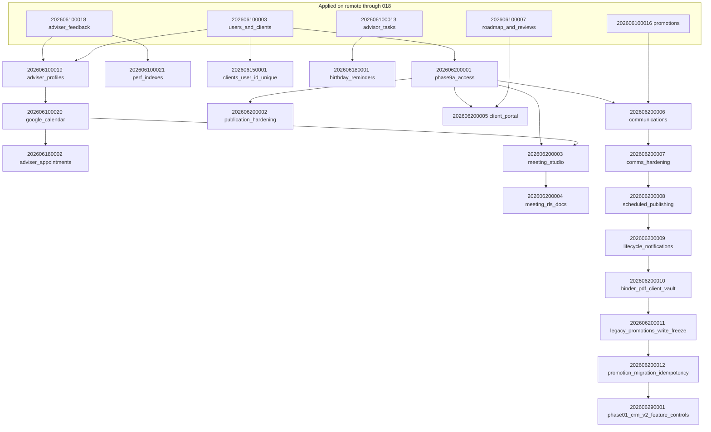

# Migration Dependency Graph

Pending migrations `202606100019`–`202606200010` and their prerequisites.

## Blocking relationships

| Migration | Blocked until |
|-----------|---------------|
| 202606100020 | 019 reconciled (optional FK path via users only, but 019 failure stops push) |
| 202606180002 | 020 tables exist |
| 202606200003 | 001 + 020 (appointment_id FK) |
| 202606200002 | 001 published_outputs |
| 202606200004 | 003 policies exist |
| 202606200005 | 001 + roadmap_items |
| 202606200006 | 001 + promotions |
| 202606200007 | 006 |
| 202606200008 | 007, platform_feature_controls |
| 202606200009 | 008, client_notifications |
| 202606200010 | 009, binder_exports, documents |
| 202606200011 | 010, platform_feature_controls, promotions |
| 202606200012 | 011, promotion_migration_reviews, governed_content, uuid-ossp |
| 202606290001 | 9F4B chain complete; `platform_feature_controls` table (from 9A1) |
| 202606290002 | 202606290001 (logical); `platform_feature_controls` INSERT `crm_v2_relationships` |
| 202606290003 | 202606290001 (logical); `platform_feature_controls` INSERT `crm_v2_appointments_adviser` |
| 202606290004 | `adviser_appointments`, `clients`, `users`; logically after 202606290003 |

## Phase 01 CRM V2 (202606290001)

| Item | Detail |
|------|--------|
| Depends on | `platform_feature_controls` (Phase 9A) |
| Blocks | Nothing downstream in current chain |
| Risk | Low — idempotent INSERT only, both flags disabled |
| Operator gate | G2 — apply only after Phase 01 QA + security sign-off |

## Phase 03 CRM V2 appointments adviser (202606290003, 202606290004)

| Item | Detail |
|------|--------|
| Depends on | `adviser_appointments` (Phase 6D), `platform_feature_controls` (Phase 9A) |
| Blocks | Phase 04 client appointments (logical) |
| Risk | Medium — schema ALTER on production appointments table |
| Operator gate | G4 — dry-run + QA before apply |

## Phase 02 CRM V2 relationships (202606290002)

| Item | Detail |
|------|--------|
| Depends on | `platform_feature_controls` (Phase 9A); logically after 202606290001 |
| Blocks | Nothing downstream in current chain |
| Risk | Low — idempotent INSERT only, flag disabled |
| Operator gate | G3 — apply only after Phase 02 QA on staging |

## Parallel-safe (after 018)

These can apply independently **once push resumes**, but 021 and 150001 do not depend on 019:

| Migration | Depends only on applied ≤018 |
|-----------|------------------------------|
| 202606100021 | ✓ (feedback, clients, discover) |
| 202606150001 | ✓ (clients) |
| 202606180001 | ✓ (clients, advisor_tasks) |

**However:** `supabase db push` applies in timestamp order — 019 must reconcile before any later migration runs.

## Critical path for drift reconciliation

1. **202606100019** — first failure; must classify EXACT_MATCH vs PARTIAL_MATCH vs CONFLICTING
2. **202606100020** — likely second risk if calendar tables were created manually
3. **202606200001** — foundation for all Phase 9 features
4. Remaining migrations chain in timestamp order

## Feature cross-dependencies (application layer)

| Application feature | Minimum migrations |
|--------------------|--------------------|
| My Adviser profiles | 019 |
| Calendar booking | 019, 020 |
| Adviser-created appointments | 020, 8B |
| Birthday reminders | 8A |
| Phase 9A access/publication | 9A1, 9A2 |
| Meeting Studio | 9A1, 020, 9C1, 9C2 |
| Converted client portal | 9A1, 9D |
| Communications governance | 9A1, 9E1, 9E2 |
| Scheduled publishing automation | 9E2, 9F1 |
| Binder PDF + client vault | 9F2, 9E1 (binder_exports), 008 (documents) |
