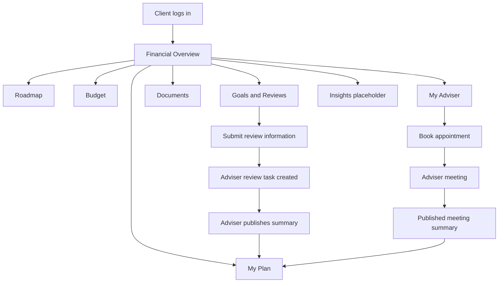

# Phase 9D — Active Client Journey

## Relationship stage

`relationship_stage = active_client` unlocks the converted portal navigation and APIs.

## Primary journey

## Client actions (self-service)

1. View adviser-published Financial Overview
2. Track roadmap client tasks (completion ≠ advice acceptance)
3. Manage budget inputs and scenarios
4. Add/update personal goals
5. Submit review information (idempotent)
6. Upload/view permitted documents
7. Contact/book adviser

## Adviser-led steps

1. Review client submissions (tasks)
2. Prepare and publish client-safe outputs
3. Mark roadmap items `client_visible`
4. Conduct meetings (Meeting Studio — adviser only)
5. Publish meeting summaries when appropriate

## Empty states

| State | Client message |
|-------|----------------|
| No publication | Your adviser is preparing an update |
| Pending review submission | Information submitted — pending adviser review |
| No roadmap tasks | Adviser will share agreed actions after review |
| Stale publication | Review recommended + book CTA |

## Platform vs adviser

Aurelis is the engagement platform. The assigned human adviser and their firm provide regulated financial advice. Client copy must not imply the platform is the regulated adviser.
